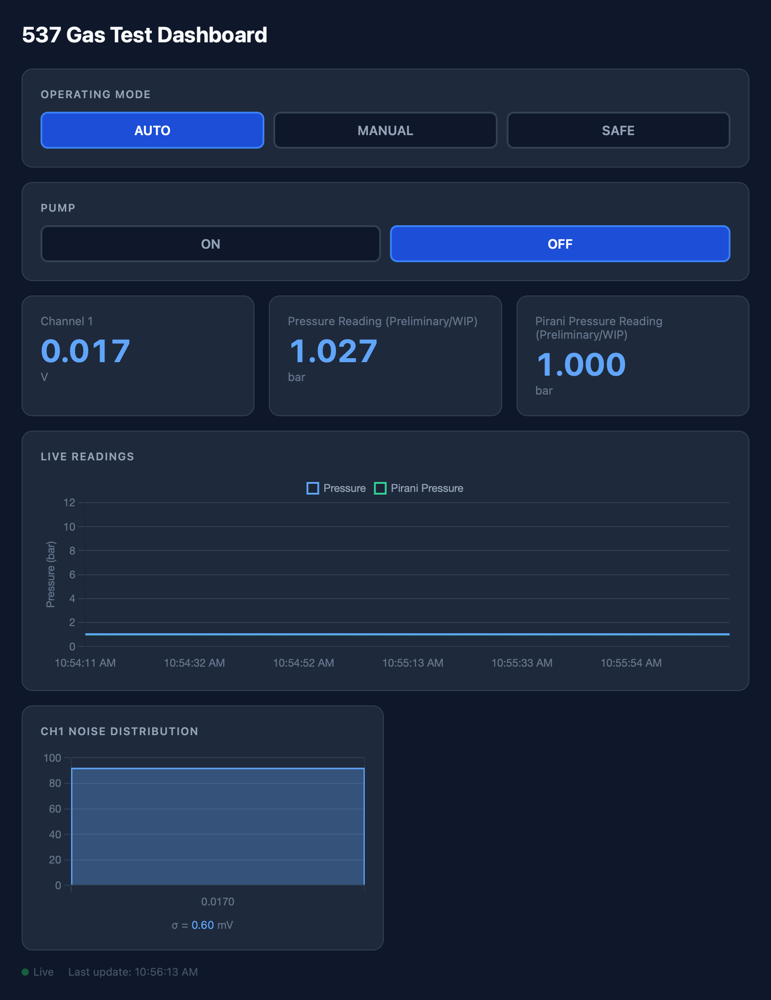

# DAQ & Control System

## Quick Start

Setup a virtual python env
```
python3 -m venv env
source env/bin/activate
pip install -r requirements.txt
```

Start the application
```
uvicorn main:app --port 8081
```

Go to [http://127.0.0.1:8081](http://127.0.0.1:8081) to see the dashboard.

## Dashboard Preview



## Flowchart


## Systemd service

The system is currently setup as a systemd service, so it should start automatically on boot. You can check the status, or start or stop the service with
```
sudo systemctl [status,start,stop] gas-test-dashboard.service
```

The systemd file lives at `/etc/systemd/system` and a copy of it can be found in this repo ([gas-test-dashboard.service](gas-test-dashboard.service)).

## Database backup

The database (`daq.db`) is regularly backed up to `/vols` by pulling from one of the lx machines with a cron job. The script that gets run by the cron job is [backup_db.sh](backup_db.sh).

## More documentation soon...